<div align="center">

# AI Research Assistant

### A Modular Multi-Agent Platform for Scientific Literature Search, Grounded Question Answering, Paper Analysis, Literature Review Generation, and Retrieval Evaluation.

---


---

*A full-stack AI research platform that assists researchers throughout the research lifecycle—from discovering scientific papers to generating grounded answers, analyzing papers, producing literature reviews, and systematically evaluating retrieval methods.*

</div>

# Demo

## Dashboard

<p align="center">
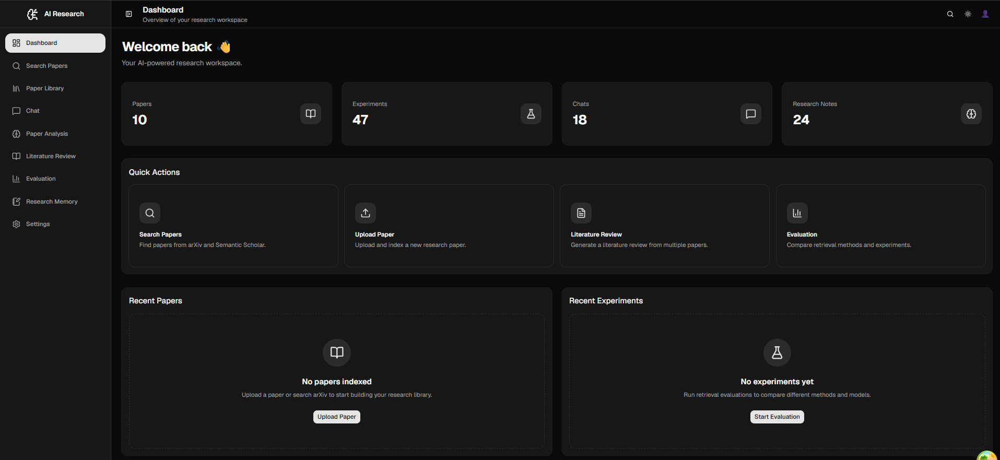
</p>

---

### Features Demonstrated

- Paper Search
- Paper Download
- Local Paper Library
- Grounded Question Answering
- Paper Analysis
- Literature Review Generation
- Multi-Agent Workflow
- Retrieval Evaluation
- Conversation Memory
- Research Memory

# Overview

AI Research Assistant is a modular, full-stack research platform designed to support researchers throughout the scientific research workflow.

Unlike traditional AI chatbots, the system combines Retrieval-Augmented Generation (RAG), multi-agent orchestration, research memory, and systematic evaluation into a single platform capable of both assisting research and evaluating AI retrieval systems.

The architecture emphasizes modularity, allowing retrieval algorithms, embedding models, and large language models to be exchanged with minimal changes to the overall system. This design makes the platform suitable for experimentation as well as practical scientific literature exploration.

# Features

| Capability | Status |
|------------|:------:|
| Search Scientific Papers | ✅ |
| Download Papers from arXiv | ✅ |
| Local Research Library | ✅ |
| PDF / TXT / DOCX Support | ✅ |
| Grounded Question Answering | ✅ |
| Multi-Agent LangGraph Workflow | ✅ |
| Paper Analysis | ✅ |
| Literature Review Generation | ✅ |
| Conversation Memory | ✅ |
| Research Memory | ✅ |
| Vector Retrieval (FAISS) | ✅ |
| BM25 Retrieval | ✅ |
| Hybrid Retrieval (RRF) | ✅ |
| Retrieval Evaluation Framework | ✅ |
| Citation Evaluation | ✅ |
| Groundedness Evaluation | ✅ |
| Hallucination Detection | ✅ |
| Experiment Reports | ✅ |
| Modern React Frontend | ✅ |

# Why This Project?

Most research assistants focus primarily on generating answers.

This project extends beyond question answering by treating Retrieval-Augmented Generation (RAG) as an experimental research problem.

In addition to assisting users with scientific literature, the platform provides an integrated evaluation framework for comparing retrieval strategies, measuring response quality, and generating reproducible experiment reports.

The system therefore serves two complementary purposes:

- **Research Assistant** — helping users search, read, analyze, and understand scientific papers.

- **Research Platform** — enabling systematic evaluation of retrieval methods, groundedness, citation quality, hallucination detection, latency, and token usage.

This dual focus makes the project suitable both as a practical research assistant and as an experimentation platform for RAG systems.

# Screenshots

## Dashboard


---

## Paper Search

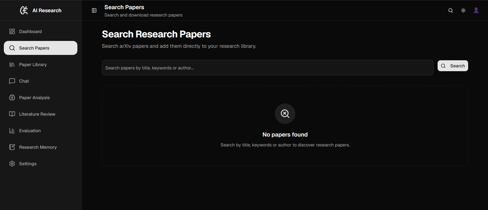

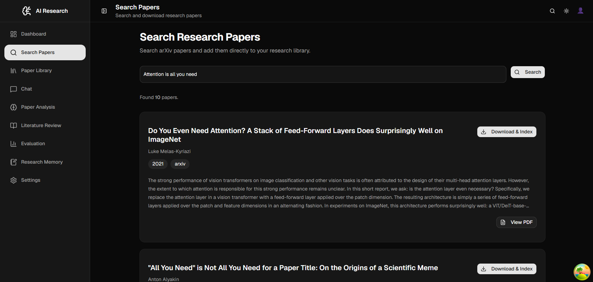

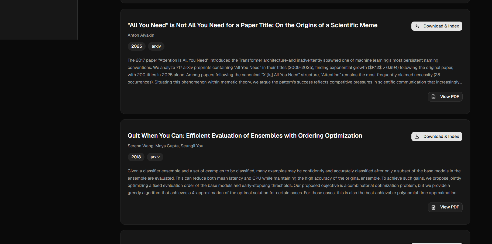

---

## Paper Library

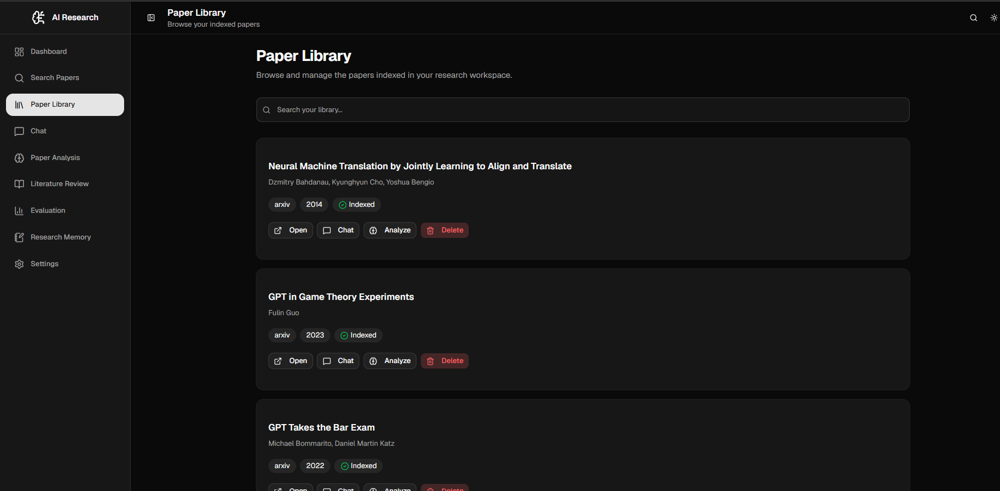

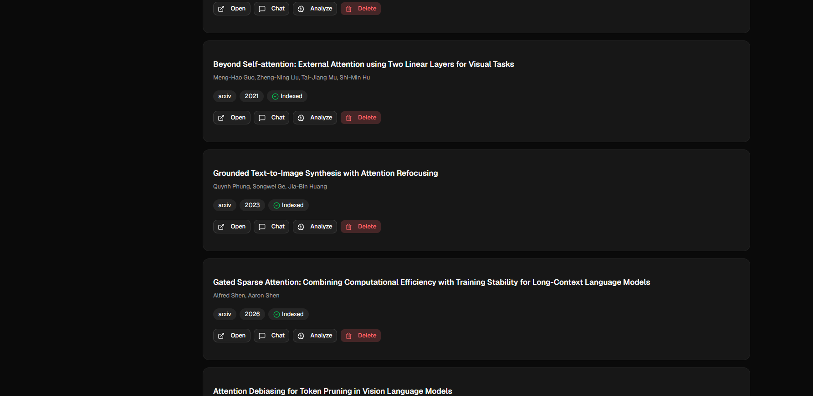

---

## Chat

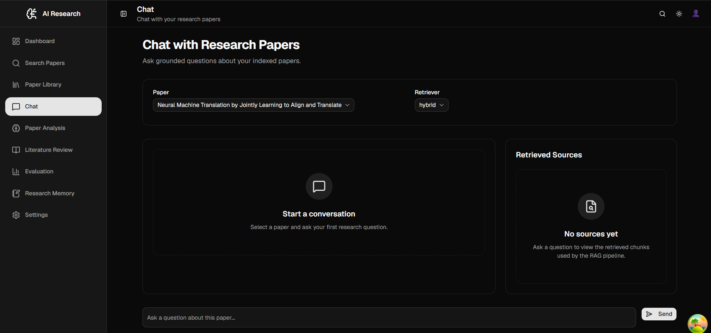

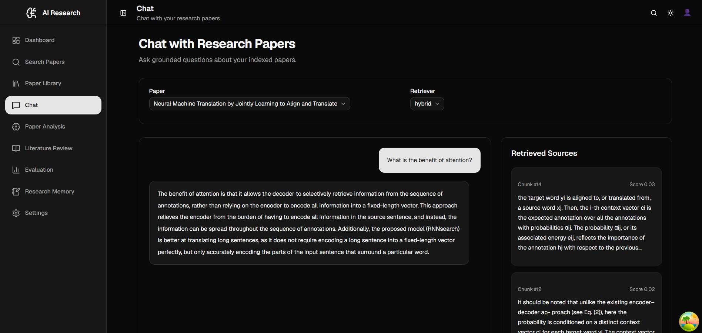

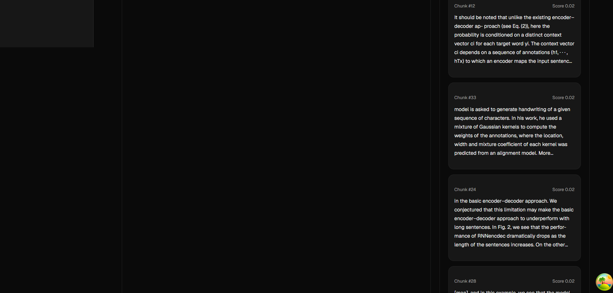

---

## Paper Analysis

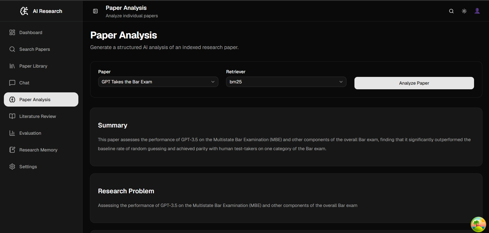

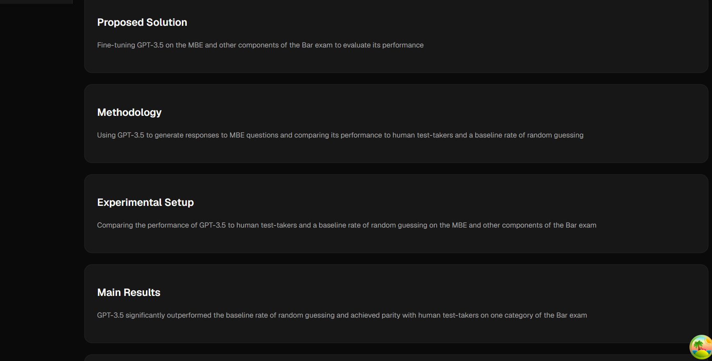

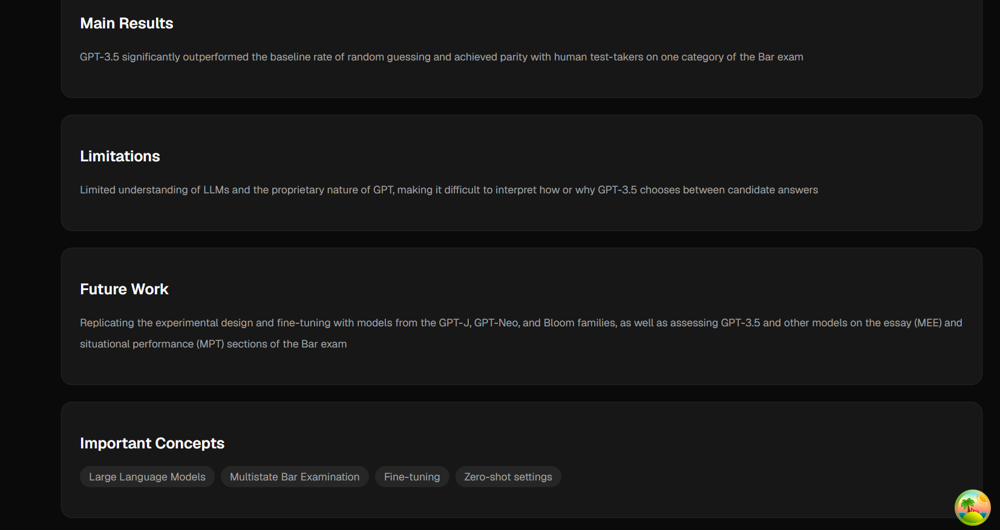

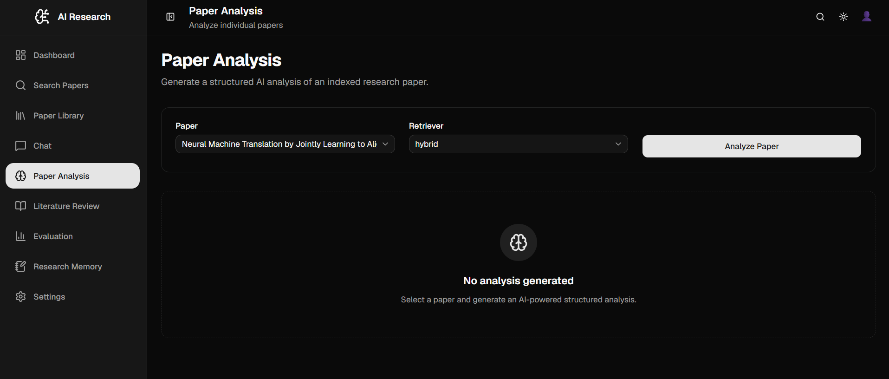

---

## Literature Review

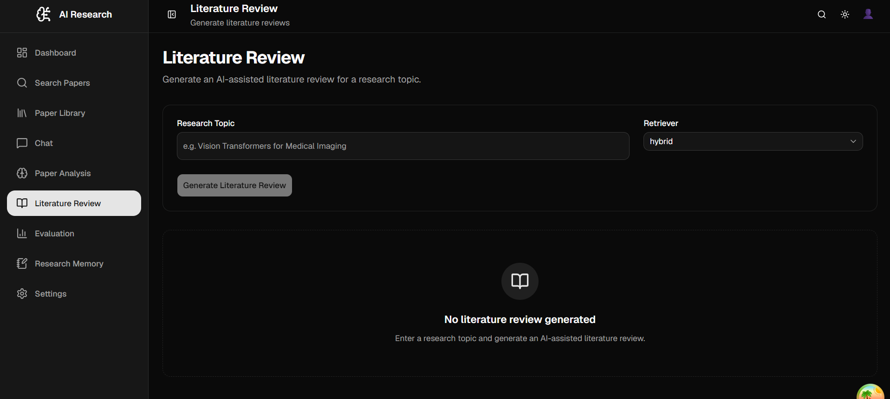

---

## Evaluation Dashboard

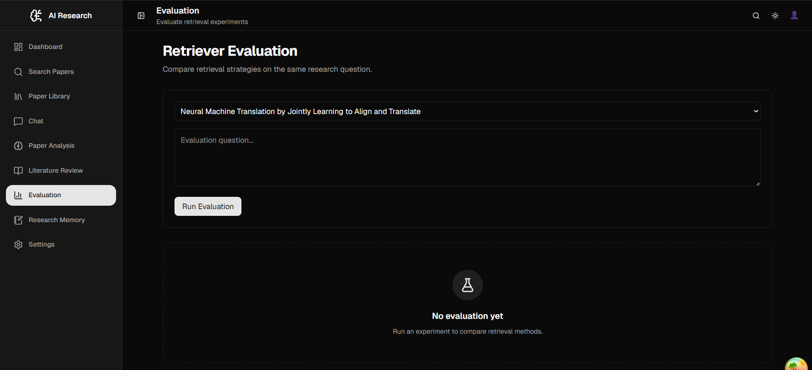

---

## Memory

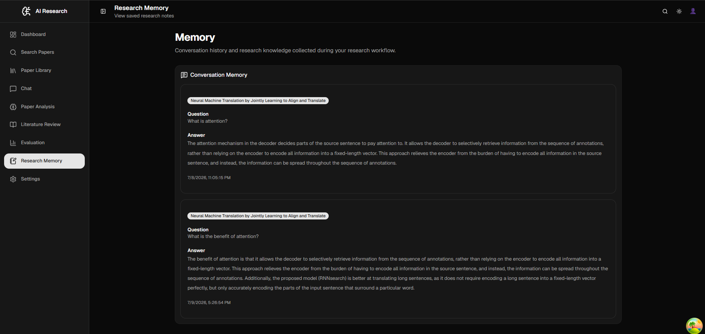

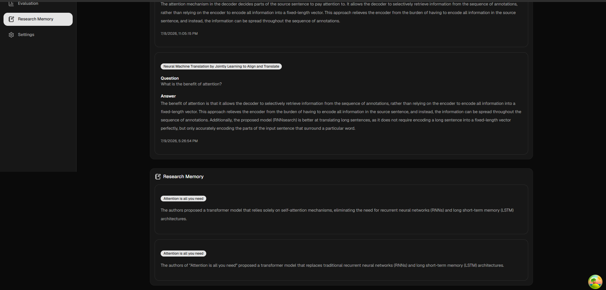

# System Architecture

The AI Research Assistant follows a modular, service-oriented architecture designed for experimentation and extensibility.

The system separates the frontend, backend services, workflow orchestration, agent reasoning, retrieval, and evaluation into independent components, allowing retrieval algorithms, embedding models, and LLMs to be replaced with minimal changes to the overall architecture.

This modular design enables the project to function both as an AI research assistant and as a research platform for evaluating Retrieval-Augmented Generation (RAG) systems.

<p align="center">

</p>

# Multi-Agent Question Answering Workflow

Instead of relying on a single LLM call, the system decomposes question answering into specialized agents using LangGraph.

Each agent performs one clearly defined responsibility before passing control to the next stage.

| Agent | Responsibility |
|--------|----------------|
| Memory Agent | Retrieves relevant conversation and research memory |
| Rewrite Agent | Improves and reformulates the user's question |
| Retrieval Agent | Retrieves relevant document chunks |
| Reasoning Agent | Generates a grounded answer using retrieved evidence |
| Critic Agent | Reviews the response for consistency and potential hallucinations |
| Writer Agent | Produces the final user-facing response |

<p align="center">

</p>

# Literature Review Workflow

The literature review pipeline automates the process of collecting and synthesizing scientific literature.

Starting from a research topic, the system searches for papers, downloads them, indexes the content, retrieves relevant evidence, summarizes individual papers, extracts common themes, and composes a structured literature review.

<p align="center">

</p>

# Modular Retrieval Architecture

The retrieval layer is designed around interchangeable retrievers.

Each retriever implements a common interface, allowing different retrieval strategies to be evaluated under identical experimental conditions.

Currently implemented retrieval methods include:

- Dense Vector Retrieval (FAISS)
- Sparse Retrieval (BM25)
- Hybrid Retrieval (Reciprocal Rank Fusion)

This modular design enables systematic comparison of retrieval quality, latency, citation accuracy, groundedness, and overall response quality.

# Evaluation Framework

A major goal of the project is not only to generate grounded responses but also to evaluate the quality of Retrieval-Augmented Generation systems.

Every experiment records multiple evaluation metrics that can later be compared across retrieval methods and model configurations.

<p align="center">

</p>

### Recorded Metrics

- Retrieval Method
- Embedding Model
- Large Language Model
- Context Length
- Latency
- Token Usage
- Citation Accuracy
- Groundedness
- Hallucination Detection
- User Feedback

The framework exports experiment results as structured reports, enabling reproducible comparison between retrieval strategies.

# Technology Stack

| Layer | Technologies |
|--------|--------------|
| Frontend | React, TypeScript, Vite, Tailwind CSS, shadcn/ui |
| Backend | FastAPI |
| Workflow Orchestration | LangGraph |
| LLM Framework | LangChain |
| Dense Retrieval | FAISS |
| Sparse Retrieval | BM25 |
| Hybrid Retrieval | Reciprocal Rank Fusion (RRF) |
| Embeddings | Sentence Transformers |
| Paper Search | arXiv API, Semantic Scholar |
| LLM Providers | Groq (Designed to support OpenAI, Claude, Gemini) |
| Evaluation | Custom Evaluation Framework + LLM-as-Judge |
| Storage | JSON-based repositories |

# Project Structure

```text
AI-Research-Assistant
│
├── app/
│   ├── agents/
│   ├── api/
│   ├── database/
│   ├── evaluation/
│   ├── memory/
│   ├── paper_download/
│   ├── paper_search/
│   ├── prompts/
│   ├── retrievers/
│   ├── services/
│   └── workflows/
│
├── frontend/
│
├── data/
│
├── screenshots/
│
├── diagrams/
│
└── README.md
```

# Design Principles

The project was developed around a small set of engineering principles that prioritize maintainability, experimentation, and extensibility.

- **Modularity** – Major capabilities such as retrieval, memory, evaluation, and workflows are implemented as independent components.
- **Experimentation** – Retrieval methods, embedding models, and LLMs can be compared under a common evaluation framework.
- **Grounded Responses** – Answers are generated using retrieved evidence instead of relying solely on parametric model knowledge.
- **Separation of Responsibilities** – Specialized LangGraph agents perform retrieval, reasoning, critique, and response generation independently.
- **Extensibility** – New retrievers, embedding models, LLM providers, and evaluation metrics can be integrated with minimal architectural changes.

# Roadmap

## Completed

- ✅ Multi-Agent Question Answering
- ✅ Paper Search
- ✅ Paper Download
- ✅ Local Paper Library
- ✅ PDF / TXT / DOCX Support
- ✅ Paper Analysis
- ✅ Literature Review Generation
- ✅ Conversation Memory
- ✅ Research Memory
- ✅ Vector Retrieval
- ✅ BM25 Retrieval
- ✅ Hybrid Retrieval
- ✅ Evaluation Framework
- ✅ Modern React Frontend

## Planned

- ⏳ Cross-Encoder Reranking
- ⏳ ChromaDB Support
- ⏳ Qdrant Support
- ⏳ Multimodal RAG
- ⏳ Figure Understanding
- ⏳ Equation Understanding
- ⏳ Docker Deployment
- ⏳ Cloud Deployment
- ⏳ Expanded Evaluation Benchmarks

# Research Motivation

Beyond providing practical assistance for reading and understanding scientific papers, this project explores Retrieval-Augmented Generation (RAG) as an engineering and research problem.

The long-term objective is to build a unified platform for evaluating retrieval strategies, embedding models, and language models under reproducible experimental conditions.

Rather than treating the assistant as a black-box chatbot, the platform emphasizes measurable quality through groundedness, citation accuracy, latency, hallucination detection, and comparative evaluation.

This direction aims to bridge practical AI tooling with applied AI research.

# Future Work

Future development will focus on expanding both the research capabilities and the experimental framework.

Planned directions include:

- Cross-Encoder Reranking
- Additional Vector Databases
- More Embedding Models
- Multiple LLM Providers
- Automated Benchmark Suites
- Figure Understanding
- Equation Understanding
- Multimodal Retrieval-Augmented Generation
- Interactive Experiment Dashboard
- Research Paper Generation
- Scientific Benchmark Datasets

# Repository Notice

This repository serves as a portfolio and documentation showcase for the AI Research Assistant project.

It includes project documentation, architecture diagrams, screenshots, and demonstrations.

The complete implementation is maintained separately in a private development repository.

# Acknowledgements

This project builds upon ideas and technologies from the open-source AI community.

Key technologies include:

- FastAPI
- React
- TypeScript
- LangGraph
- LangChain
- FAISS
- Sentence Transformers
- arXiv
- Semantic Scholar

# Citation

If this project contributes to your research or work, please cite the accompanying research publication once available.

Citation information will be added after publication.

# License

This repository is provided for portfolio and demonstration purposes.

All rights reserved.

The project documentation, diagrams, and media may not be redistributed or used commercially without permission.
